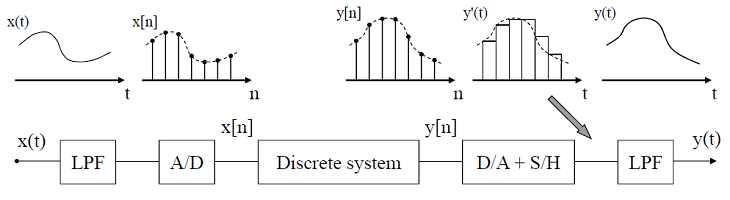

# U.Porto-version-of-DSP-Education-Kit

This is an adaptation of the original [ARM University DSP Education Kit](https://github.com/arm-university/Digital-Signal-Processing-Education-Kit) to serve the specificities of an undergraduate signal processing course at the University of Porto - Faculty of Engineering. Our course (called Fundamentals of Signal Processing) had its first edition in 2021/2022, and is structured as a combination of three types of classes: lectures (1.5 h/week), applied theory (1.5 h/week), and labs (1 h/week). Although this arrangement may change in the near future, the [current course syllabus](https://sigarra.up.pt/feup/en/UCURR_GERAL.FICHA_UC_VIEW?pv_ocorrencia_id=485397) and the rather short duration of lab classes recommend an adapted version of the original ARM lab materials so that students can address in the lab a few key experiments and associated questions whcih are subject to grading.  
We describe next what the focus is in each lab and how it relates to the orginal ARM lab materials.
## LAB 01 
**Lab Summary:** Getting started with the DSP Education kit: LUT-based Real-Time Sine Wave Generation), Basic Analogue Input & Output Using the STM32F746G Disco Board, and Delaying the Signal.

This first DSP lab consists of a simplified version of the original ARM “LAB 1 Analog Input and Output” that is included in the original ARM Module_1/Lab/IntroductionLab folder. It assumes that all the installation steps that are specified in the original ARM “DSP_Getting_Started_Guide.docx” have been followed through and successfully completed. In our case, before the start of lab classes, all lab PCs have been configured according to the instructions in the original ARM “DSP_Getting_Started_Guide.docx”. 
## LAB 02 
**Lab Summary:** Getting started with the DSP Education kit: viewing program output.

This lab consists of a continuation of the previous lab. It is based on the section of the original ARM “LAB 1 Analog Input and Output” that is included in the original ARM Module_1/Lab/IntroductionLab folder and that focusses on exporting to Matlab specific memory contents of the STM32F7 Kit. Two signals are generated on the Kit: a deterministic signal (a sinusoid) and a random signal (using a pseudo-random sequence generator). 
## LAB 03
**Lab Summary:** Understanding sampling and reconstruction: understanding that filtering effects depend on the frequency response characteristics of the filter (either analog, or discrete-time), understanding the different components in a complete signal processing chain, understanding basic effects of sampling and reconstruction on sinusoidal, rectangular, triangular, and sawtooth waves.

This lab consists of an adaptation of the previous labs highlighting the complete signal processing chain and that includes both analog and discrete-time filters. Students are motivated to understand that although two filters have the exact same frequency response magnitude, the output wave may look different because of the phase response of the filters, for example if one filter is linear-phase, and the other is minimum-phase. Then, students are also motivated to understand why different waveforms at the input of the STM32F7 Kit appear as pure sinusoids at the output of the Kit for different frequencies.
## LAB 04
**Lab Summary:** Measuring the frequency response of a moving average filter that is implemented and running in real-time on the STM32F746G Discovery board using different (recursive and non-recursive) but equivalent difference equations.

This lab is a simplified and adapted version of the original ARM “LAB 3 -Finite Impulse Response (FIR) Filters” that is included in the original ARM Module_6/Lab/ folder. The lab introduces FIR filtering using as a baseline a moving average filter of length 5, and motivates the experimental assessment of the frequency response of this and other FIR filters running in real-time on the STM32F746G board. 
## LAB 05
**Lab Summary:** Experimental determination of the frequency response of FIR and IIR comb filters running in real-time on the STM32F746G Discovery board.

This lab is a continuation of the previous lab and has been adapted to highlight the different types of comb filters (FIR, IIR, and general) and to emphasize that their theoretical and practical frequency responses are consistent with the Z-domain analysis of those filters. Aspects of special interest are the effects of poles (in terms of peaks in the frequency response magnitude), and the effects of zeros (in terms of valleys in the frequency response magnitude).
